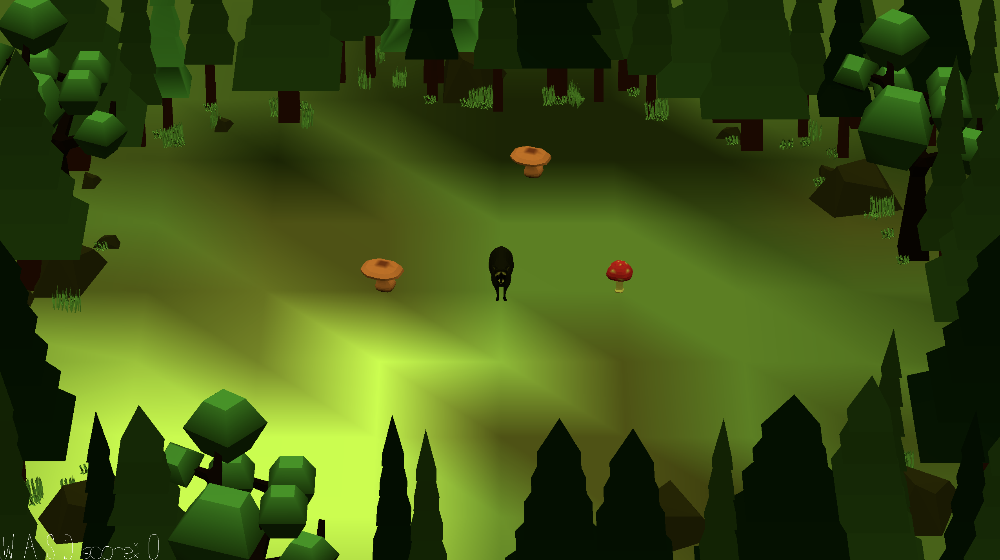

# Raccoon of Doom

Author: Sarah Di (sarahdi)

Design: My game is based on the snake game but with a raccoon picking mushrooms.
One thing that is different from the original snake is that not all foodstuffs are the same.
There are red mushrooms and there are brown mushrooms. Red mushrooms are really poisonous
and if the raccoon eats it it will be disoriented and slowed. Brown mushrooms are delicious and
if the raccoon eat it it will receive a slight speed increase. Greater risk has greater reward; red mushrooms
are worth 3x more points than brown mushrooms.

Screen Shot:

How To Play:

WASD keys to control the raccoon. Collect mushrooms.

This game was built with [NEST](NEST.md).
